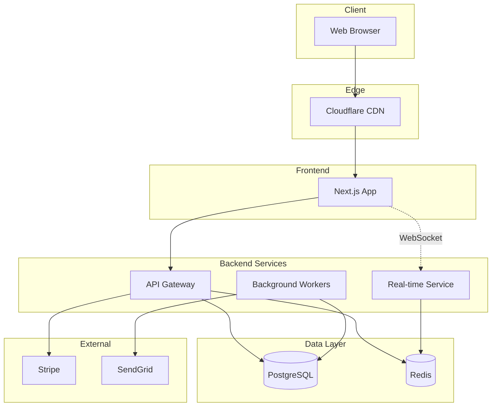

# TaskFlow - Task Management SaaS

> A modern task management platform for teams with real-time collaboration

| Property | Value |
|----------|-------|
| **Version** | 1.0.0 |
| **Type** | SaaS Application |
| **Architecture** | Microservices |
| **Complexity** | Complex |
| **Timeline** | 28 day(s) (with 20% buffer) |
| **Created** | 2024-12-05 10:00 |
| **Updated** | 2024-12-05 10:00 |

**Tech Stack:** React, Next.js, Tailwind CSS, Node.js/Express, PostgreSQL, Redis, Docker, Railway, Stripe

---

## 🎯 Overview

### Problem Statement
Teams struggle with task management because existing tools are either too simple (lacking features) or too complex (overwhelming UI). Most tools lack real-time collaboration, making it hard for remote teams to stay synchronized. Additionally, switching between planning, execution, and reporting requires multiple tools.

### Solution
TaskFlow provides an intuitive task management platform that combines Kanban boards, list views, and calendar views with real-time collaboration. Teams can plan sprints, track progress, and generate reports all in one place. The clean, focused UI reduces cognitive load while powerful features remain accessible.

### Value Proposition
- **Unified workspace**: Planning, execution, and reporting in one tool
- **Real-time collaboration**: See changes instantly, no refresh needed
- **Smart automation**: Reduce manual work with rules and integrations
- **Affordable pricing**: Free tier for small teams, competitive pricing for larger teams

### Target Users
- Small to medium development teams (5-50 people)
- Project managers overseeing multiple projects
- Remote-first companies needing async collaboration
- Startups looking for affordable project management

---

## ✨ Scope (MoSCoW)

### Must Have (P0) - Critical
- User registration and authentication (email + OAuth)
- Workspace and team management
- Project creation and configuration
- Task CRUD with titles, descriptions, assignees, due dates
- Kanban board view with drag-and-drop
- List view with sorting and filtering
- Real-time updates across clients
- Basic notification system (in-app)
- Responsive design (mobile-friendly)
- Stripe subscription integration

### Should Have (P1) - Important  
- Comments on tasks
- File attachments
- Task labels/tags
- Sprint/milestone planning
- Calendar view
- Activity history/audit log
- Email notifications
- Search functionality
- Dark mode

### Could Have (P2) - Nice to Have
- Time tracking
- Custom fields
- Workflow automation rules
- Third-party integrations (Slack, GitHub)
- Recurring tasks
- Task templates
- Export to CSV/PDF
- Mobile apps (React Native)

### Won't Have - Out of Scope ⚠️
- Video conferencing integration
- Built-in chat/messaging
- Gantt charts (for MVP)
- Resource management
- Invoicing/billing to clients
- White-labeling
- Self-hosted option
- Desktop native apps

### Key Requirements

**Critical (P0):**
- `REQ-001` System must support real-time updates across all connected clients
- `REQ-002` Users must be able to create, read, update, and delete tasks
- `REQ-003` System must support OAuth authentication (Google, GitHub)
- `REQ-004` Workspaces must isolate data between different organizations
- `REQ-005` System must process payments securely via Stripe

**Important (P1):**
- `REQ-006` Users must be able to comment on tasks
- `REQ-007` System must send email notifications for important events
- `REQ-008` Users must be able to search across all tasks and projects
- `REQ-009` System must maintain activity history for audit purposes
- `REQ-010` Interface must support dark mode

### User Stories

- **US-001** [P0]: As a team lead, I want to create a project board, so that my team can organize tasks visually
- **US-002** [P0]: As a developer, I want to drag tasks between columns, so that I can update status quickly
- **US-003** [P0]: As a team member, I want to see changes in real-time, so that I'm always looking at current data
- **US-004** [P1]: As a project manager, I want to filter tasks by assignee, so that I can see individual workloads
- **US-005** [P1]: As a user, I want to receive notifications, so that I know when tasks are assigned to me

---

## 🏗️ Technical Architecture

### Style
**Microservices**

### Tech Stack
- **Frontend:** React, Next.js 14, Tailwind CSS, React Query
- **Backend:** Node.js, Express, Socket.io
- **Database:** PostgreSQL, Redis
- **Infrastructure:** Docker, Railway, Cloudflare
- **Tools:** Stripe, SendGrid, Sentry

### Components

#### Web Application
- **Type:** frontend
- **Description:** Next.js application serving the main user interface
- **Technologies:** Next.js, React, Tailwind CSS, React Query
- **Responsibilities:**
  - Render UI components
  - Handle user interactions
  - Manage client-side state
  - Communicate with API

#### API Gateway
- **Type:** backend
- **Description:** Main API server handling all HTTP requests
- **Technologies:** Node.js, Express
- **Responsibilities:**
  - Route requests
  - Authentication/authorization
  - Input validation
  - Rate limiting

#### Real-time Service
- **Type:** backend
- **Description:** WebSocket server for real-time updates
- **Technologies:** Node.js, Socket.io, Redis
- **Responsibilities:**
  - Manage WebSocket connections
  - Broadcast updates
  - Handle presence

#### Background Workers
- **Type:** backend
- **Description:** Async job processing for emails, notifications
- **Technologies:** Node.js, Bull, Redis
- **Responsibilities:**
  - Send emails
  - Process notifications
  - Handle scheduled tasks

#### Database
- **Type:** database
- **Description:** Primary data storage
- **Technologies:** PostgreSQL
- **Responsibilities:**
  - Store all application data
  - Maintain data integrity
  - Handle queries

### Architecture Diagram



### Constraints
- Multi-tenant data isolation required
- 99.9% uptime target
- GDPR compliant data handling
- Response time < 200ms for API calls
- Support 1000 concurrent WebSocket connections
- Secure payment handling (PCI compliant via Stripe)

### Assumptions
- Users have modern browsers (Chrome, Firefox, Safari, Edge)
- Users have stable internet connection
- Initial scale: up to 10,000 active users
- Most users in US/EU timezones

### Risk Assessment

| Risk | Impact | Mitigation |
|------|--------|------------|
| Scope creep | High | Strict adherence to Won't Have list, weekly scope reviews |
| Real-time complexity | High | Start with polling, add WebSocket incrementally |
| Multi-tenancy security | High | Thorough security review, automated testing |
| Payment integration issues | Medium | Use Stripe's hosted checkout, extensive testing |
| Performance at scale | Medium | Load testing early, horizontal scaling design |

---

## 💾 Data Model

### User
Core user entity

| Field | Type |
|-------|------|
| id | uuid |
| email | string (unique) |
| name | string |
| avatar_url | string (nullable) |
| password_hash | string (nullable, for email auth) |
| oauth_provider | string (nullable) |
| oauth_id | string (nullable) |
| created_at | timestamp |
| updated_at | timestamp |

### Workspace
Organization/team container

| Field | Type |
|-------|------|
| id | uuid |
| name | string |
| slug | string (unique) |
| owner_id | uuid (FK: User) |
| plan | enum (free, pro, enterprise) |
| stripe_customer_id | string (nullable) |
| created_at | timestamp |

**Relationships:**
- has many Members (through WorkspaceMember)
- has many Projects

### Project
Collection of tasks

| Field | Type |
|-------|------|
| id | uuid |
| workspace_id | uuid (FK: Workspace) |
| name | string |
| description | text (nullable) |
| color | string |
| is_archived | boolean |
| created_at | timestamp |

**Relationships:**
- belongs to Workspace
- has many Tasks
- has many Columns

### Task
Work item

| Field | Type |
|-------|------|
| id | uuid |
| project_id | uuid (FK: Project) |
| column_id | uuid (FK: Column) |
| title | string |
| description | text (nullable) |
| assignee_id | uuid (FK: User, nullable) |
| due_date | date (nullable) |
| priority | enum (low, medium, high, urgent) |
| position | integer |
| created_by | uuid (FK: User) |
| created_at | timestamp |
| updated_at | timestamp |

**Relationships:**
- belongs to Project
- belongs to Column
- has many Comments
- has many Labels (through TaskLabel)

---

## 🔌 API Specification

| Method | Endpoint | Description | Auth |
|--------|----------|-------------|------|
| `POST` | `/api/auth/register` | Register new user | - |
| `POST` | `/api/auth/login` | Login user | - |
| `POST` | `/api/auth/oauth/:provider` | OAuth authentication | - |
| `GET` | `/api/me` | Get current user | 🔒 |
| `GET` | `/api/workspaces` | List user workspaces | 🔒 |
| `POST` | `/api/workspaces` | Create workspace | 🔒 |
| `GET` | `/api/workspaces/:id` | Get workspace | 🔒 |
| `GET` | `/api/workspaces/:id/projects` | List projects | 🔒 |
| `POST` | `/api/workspaces/:id/projects` | Create project | 🔒 |
| `GET` | `/api/projects/:id` | Get project with tasks | 🔒 |
| `POST` | `/api/projects/:id/tasks` | Create task | 🔒 |
| `PATCH` | `/api/tasks/:id` | Update task | 🔒 |
| `DELETE` | `/api/tasks/:id` | Delete task | 🔒 |
| `POST` | `/api/tasks/:id/comments` | Add comment | 🔒 |
| `POST` | `/api/billing/checkout` | Create Stripe checkout session | 🔒 |

### Endpoint Details

#### `POST /api/auth/register`
Register a new user account

**Request Body:**
```json
{
  "email": "user@example.com",
  "password": "securepassword",
  "name": "John Doe"
}
```

**Response:**
```json
{
  "user": { "id": "uuid", "email": "...", "name": "..." },
  "token": "jwt-token"
}
```

#### `POST /api/projects/:id/tasks`
Create a new task in a project

**Authentication:** Required 🔒

**Request Body:**
```json
{
  "title": "Implement login page",
  "description": "Create login form with validation",
  "column_id": "uuid",
  "assignee_id": "uuid",
  "due_date": "2024-12-15",
  "priority": "high"
}
```

**Response:**
```json
{
  "task": {
    "id": "uuid",
    "title": "...",
    "position": 1,
    "created_at": "..."
  }
}
```

---

## 🚶 User Flows

### User Registration
New user signs up for TaskFlow

```
1. User clicks "Sign Up" on landing page
2. User enters email, password, and name
3. System validates input and checks email uniqueness
4. System creates user account
5. System sends verification email
6. User is redirected to onboarding
7. User creates first workspace
8. User is taken to empty project dashboard
```

### Create and Manage Tasks
User creates and organizes tasks on a Kanban board

```
1. User navigates to project board
2. User clicks "Add Task" in a column
3. User enters task title (required)
4. User optionally adds description, assignee, due date
5. Task appears in column
6. User drags task to different column to change status
7. Other team members see update in real-time
```

### Subscription Upgrade
User upgrades from free to pro plan

```
1. User clicks "Upgrade" in workspace settings
2. System displays plan comparison
3. User selects Pro plan
4. System redirects to Stripe checkout
5. User completes payment
6. Stripe webhook notifies system
7. System upgrades workspace plan
8. User sees Pro features enabled
```

---

## 📁 File Structure

```
taskflow/
├── apps/
│   ├── web/                    # Next.js frontend
│   │   ├── src/
│   │   │   ├── app/           # App router pages
│   │   │   ├── components/    # React components
│   │   │   ├── hooks/         # Custom hooks
│   │   │   ├── lib/           # Utilities
│   │   │   └── styles/        # Global styles
│   │   └── package.json
│   │
│   └── api/                    # Express backend
│       ├── src/
│       │   ├── routes/        # API routes
│       │   ├── controllers/   # Request handlers
│       │   ├── services/      # Business logic
│       │   ├── models/        # Database models
│       │   ├── middleware/    # Express middleware
│       │   └── utils/         # Helpers
│       └── package.json
│
├── packages/
│   └── shared/                 # Shared types/utils
│       ├── src/
│       └── package.json
│
├── infrastructure/
│   ├── docker/
│   │   ├── Dockerfile.web
│   │   └── Dockerfile.api
│   └── railway/
│       └── railway.toml
│
├── docker-compose.yml
├── turbo.json
└── README.md
```

---

## 📊 Implementation Phases

### Phase 1: Foundation
_Core infrastructure and authentication_

**Estimated Duration:** 5 days

**Tasks:**
- [ ] Set up monorepo with Turborepo
- [ ] Create Next.js app with Tailwind CSS
- [ ] Create Express API with TypeScript
- [ ] Set up PostgreSQL database and schema
- [ ] Implement user registration and login
- [ ] Implement OAuth (Google)
- [ ] Set up JWT authentication
- [ ] Create basic protected routes

**Deliverables:**
- Users can register and log in
- OAuth authentication working
- Protected API routes

**Success Criteria:**
- User can sign up with email
- User can sign in with Google
- Protected routes return 401 for unauthenticated requests

### Phase 2: Core Entities
_Workspaces, projects, and basic task management_

**Estimated Duration:** 5 days

**Tasks:**
- [ ] Implement workspace CRUD
- [ ] Implement workspace member management
- [ ] Implement project CRUD
- [ ] Implement column/status management
- [ ] Implement task CRUD
- [ ] Build basic Kanban board UI
- [ ] Implement drag-and-drop for tasks

**Deliverables:**
- Working Kanban board
- Task creation and management
- Basic project organization

**Success Criteria:**
- User can create workspace and invite members
- User can create projects with columns
- User can create, edit, and move tasks

### Phase 3: Real-time & Collaboration
_Real-time updates and team features_

**Estimated Duration:** 5 days

**Tasks:**
- [ ] Set up Socket.io server
- [ ] Implement real-time task updates
- [ ] Implement presence indicators
- [ ] Add task comments
- [ ] Implement activity log
- [ ] Add in-app notifications

**Deliverables:**
- Real-time board updates
- Team collaboration features
- Activity tracking

**Success Criteria:**
- Changes sync across clients in < 1 second
- Users can comment on tasks
- Users see notification for assigned tasks

### Phase 4: Billing & Polish
_Subscription system and production readiness_

**Estimated Duration:** 5 days

**Tasks:**
- [ ] Integrate Stripe subscriptions
- [ ] Implement plan limitations
- [ ] Add email notifications (SendGrid)
- [ ] Implement search functionality
- [ ] Add dark mode
- [ ] Performance optimization
- [ ] Error tracking (Sentry)
- [ ] Production deployment

**Deliverables:**
- Working subscription system
- Email notifications
- Production-ready application

**Success Criteria:**
- Users can subscribe to Pro plan
- Free tier limitations enforced
- Application deployed and accessible

---

## 🧪 Testing Strategy

### Unit Tests
- Framework: Jest, React Testing Library
- Service layer business logic
- React component rendering
- Utility functions
- Input validation

### Integration Tests
- API endpoint responses
- Database operations
- Authentication flows
- Stripe webhook handling

### End-to-End Tests
- Framework: Playwright
- User registration to first task flow
- Subscription upgrade flow
- Real-time collaboration scenario

### Manual Testing Checklist
- [ ] Test all OAuth providers
- [ ] Test subscription edge cases
- [ ] Cross-browser testing
- [ ] Mobile responsiveness
- [ ] Accessibility audit

---

## 🚀 Deployment

### Strategy
Railway - Simple push to deploy

### CI/CD Pipeline
1. Install dependencies
2. Run linting (ESLint, Prettier)
3. Run unit tests
4. Run integration tests
5. Build project
6. Deploy to staging (on PR)
7. Deploy to production (on main merge)

---

## ✨ Quality Requirements

### Performance
- Page load time < 3 seconds
- API response time < 200ms (p95)
- Real-time updates < 1 second latency
- Support 1000 concurrent WebSocket connections

### Security
- Input validation on all endpoints
- SQL injection prevention (parameterized queries)
- XSS prevention (React default escaping)
- CSRF protection
- Rate limiting on API endpoints
- Secure session management
- HTTPS only

### Accessibility
- WCAG 2.1 AA compliance
- Keyboard navigation support
- Screen reader compatibility
- Sufficient color contrast

---

## 🎯 Success Criteria

The project is complete when:

- [ ] Users can register and authenticate (email + OAuth)
- [ ] Users can create and manage workspaces
- [ ] Users can create projects with Kanban boards
- [ ] Users can create, edit, move, and delete tasks
- [ ] Real-time updates work across clients
- [ ] Users can comment on tasks
- [ ] Users can subscribe via Stripe
- [ ] Email notifications work
- [ ] Application is deployed and accessible
- [ ] All tests passing
- [ ] Performance targets met
- [ ] Security review passed

---

## 🤖 Instructions for AI

When implementing this specification:

### Before Starting
1. **Read the entire spec** before writing any code
2. **Summarize your understanding** in 2-3 sentences
3. **Ask clarifying questions** if anything is ambiguous
4. **Confirm the approach** before implementing

### During Implementation
1. **Implement one phase at a time** - validate before moving on
2. **Follow the file structure** defined above
3. **Respect all constraints** listed in Technical Architecture
4. **Use only specified technologies** unless discussing alternatives
5. **Add comments** for complex logic
6. **Handle errors gracefully** with meaningful messages

### After Each Phase
1. **Run tests** if defined
2. **Check against success criteria**
3. **Summarize what was done**
4. **Identify any blockers** before moving on

### Questions to Address Before Starting
- Best practices for Next.js 14 App Router
- Socket.io scaling considerations
- Stripe webhook security best practices
- Multi-tenant database design patterns

### ⚠️ Important Warnings
- Don't add features not in the spec
- Follow the defined file structure
- Use only specified technologies
- Keep code simple and readable
- Handle errors gracefully
- No chat/messaging features (explicitly out of scope)
- No Gantt charts (explicitly out of scope)

### Suggested First Prompt

```
I have a project spec I'd like you to implement: "TaskFlow - Task Management SaaS"

Please:
1. Read SPEC.md carefully  
2. Summarize your understanding in 2-3 sentences
3. List any clarifying questions
4. Wait for my answers before starting Phase 1
```

---

*Generated with Speckit 2.0 🛠️*
*Spec Version: 1.0.0*
